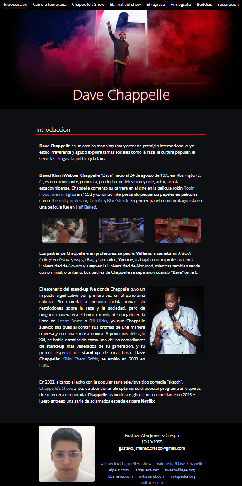

# TP - Final parcial-_2
## dwn1dv-jimenez-parcial-_2FINAL-chapelle

## Consigna:
Página web estática que cumpla con las buenas prácticas de **usabilidad, accesibilidad y semántica**, manteniendo coherencia y claridad en el contenido. La página debe tener un **mínimo de 6 secciones semánticas** y un **formulario funcional**.

**usabilidad y la claridad**. El documento debe tener una **etiqueta `<meta>`** correcta y seguir un **HTML semántico**, con buena **cohesión y acoplamiento**. Todas las etiquetas deben respetar la **anatomía**: apertura y cierre correctos, nombres en **minúscula** (`<h1></h1>`). Se deben usar **atributos** correctamente (`<a href="">texto link</a>`), definir el **lenguaje con lang**, incluir **comentarios** para organizar el código, mantener **prolijidad**, estructurar bien los **directorios**, y usar **imágenes sin modificarlas**. La página debe contener un **mínimo de secciones semánticas**, un **formulario funcional**, enlaces claros, y una organización que facilite la lectura y mantenimiento del código.

## Images

# TP - parcial-_1
## dwn1dv-jimenez-parcial-_1-SPACE-GIRLS

## Consigna:

Crear una **vista web estática** en HTML que represente un tema dado: **Space Girl**. La página debe incluir una estructura organizada de archivos, separando correctamente **HTML, CSS e imágenes**. Se espera el uso de **buenas prácticas de maquetado**, incluyendo HTML semántico.
